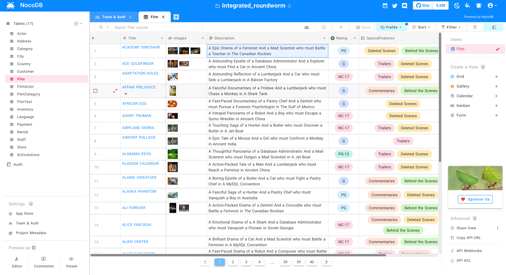
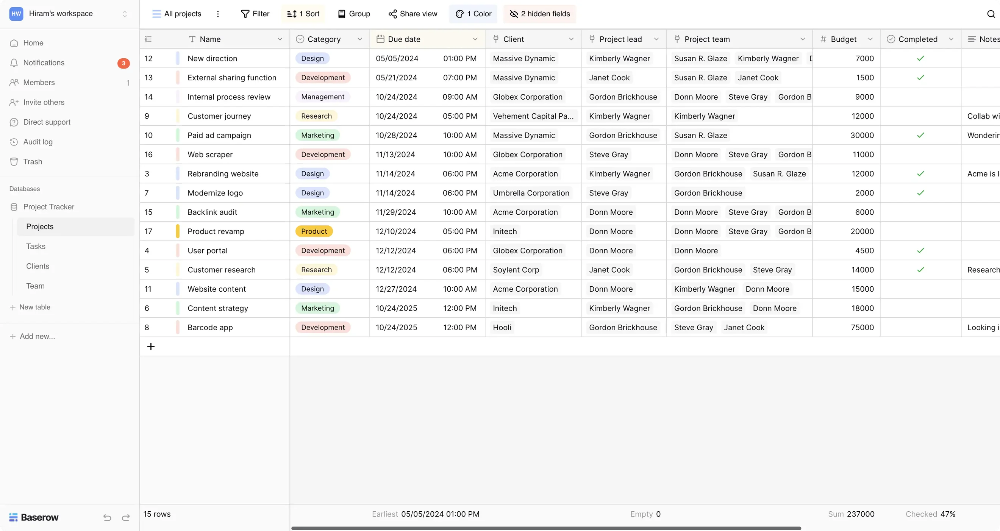
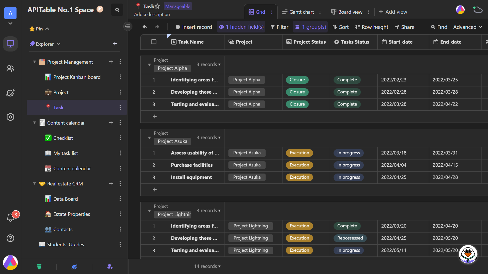
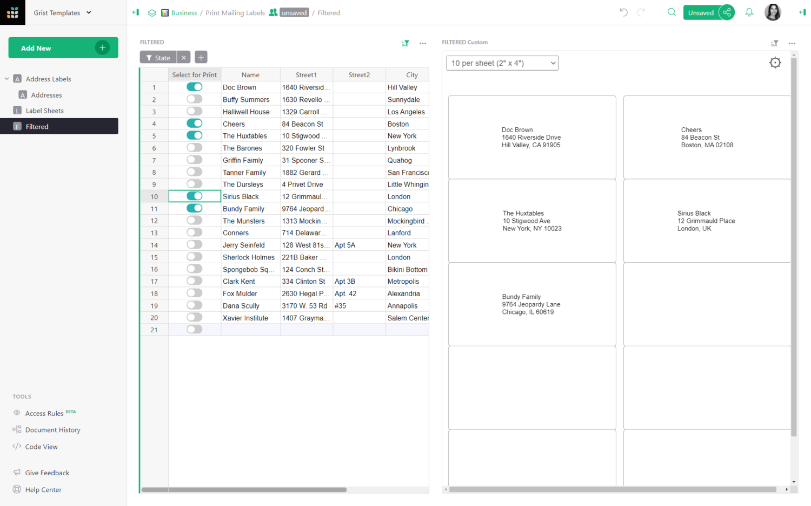
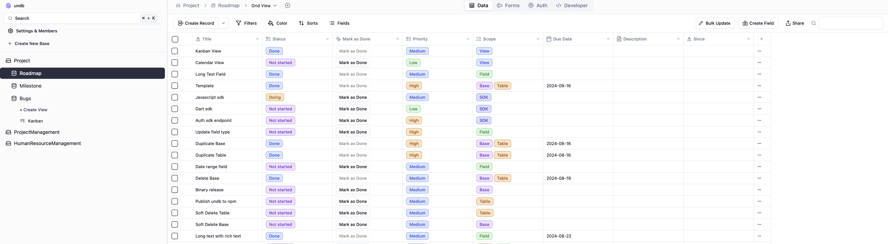

Looking for the best self-hosted Airtable alternatives? You've come to the right place! While Airtable is a fantastic tool for organizing and managing data with its spreadsheet-database hybrid capabilities, some users prefer self-hosted solutions that offer more control, customization, and privacy.

Whether you're concerned about data sovereignty, need more features, or simply want to avoid subscription fees, there are several impressive options that can fit your needs. In this article, we'll explore some of the top contenders that provide the flexibility and power you're looking for in a self-hosted environment. In case you are interested to check the best self hosted apps for your business you can check: [Best Self Hosted Apps for Business](https://www.bitdoze.com/docker-containers-business/)

## Overview of Airtable and its Popularity

Airtable has revolutionized the way we think about databases and spreadsheets. Its intuitive interface combines the familiarity of a spreadsheet with the power of a relational database, making it accessible to both technical and non-technical users. The platform's popularity stems from its versatility, allowing users to create everything from simple to-do lists to complex project management systems.

Key features that have contributed to Airtable's success include:

- Customizable views (Grid, Calendar, Kanban, Gallery)
- Rich field types (including attachments, long text, and formulas)
- Automation capabilities
- Integrations with popular tools and services
- Collaboration features

Despite its advantages, Airtable's cloud-based nature raises concerns about data privacy, control, and long-term costs for some users. This has led to a growing interest in self-hosted alternatives that offer similar functionality while addressing these concerns.

## Understanding Self-Hosted Database Solutions

Self-hosted database solutions provide an alternative to cloud-based services like Airtable by allowing users to run the software on their own infrastructure. This approach offers several benefits:

1. **Data Control**: You have complete ownership and control over your data, ensuring compliance with data protection regulations.
2. **Customization**: Self-hosted solutions often allow for deeper customization to fit specific needs.
3. **Cost-Effectiveness**: While there may be initial setup costs, self-hosting can be more economical in the long run, especially for larger organizations.
4. **Privacy**: Your data remains on your servers, reducing the risk of external breaches.
5. **Performance**: You can optimize hardware and network configurations for your specific use case.

However, self-hosting also comes with responsibilities:

- Server management and maintenance
- Security implementation and updates
- Backup and disaster recovery planning

For organizations with the technical expertise or willingness to learn, these challenges often outweigh the benefits of having full control over their data infrastructure.

## Where You Can Host Airtable Alternatives

When considering self-hosted Airtable alternatives, you have several options for where to deploy your chosen solution. Each option has its own set of advantages and considerations.

### VPS Server With Hetzner, DigitalOcean, etc.

Virtual Private Servers (VPS) offer a flexible and cost-effective way to host your Airtable alternative. Providers like Hetzner and DigitalOcean offer scalable resources and easy deployment options.

**Advantages:**
- Affordable starting prices
- Scalable resources
- High availability and uptime
- Managed services options

**Considerations:**
- Requires some technical knowledge for setup and maintenance
- Network bandwidth limitations may apply
- Shared hardware resources (unless using dedicated instances)

To get started, you can visit [Hetzner](https://go.bitdoze.com/hetzner) or [DigitalOcean](https://go.bitdoze.com/do) to explore their VPS offerings.


> In case you are interested to monitor server resources like CPU, memory, disk space you can check: [How To Monitor Server and Docker Resources](https://www.bitdoze.com/sever-monitoring/)

### Home Server

For those who prefer complete control over their hardware and network, a home server can be an excellent option for hosting Airtable alternatives.

#### Mini PC

Mini PCs offer a compact and energy-efficient solution for home servers. They're powerful enough to run most self-hosted applications while taking up minimal space.

**Advantages:**
- Complete hardware control
- One-time hardware cost
- Low power consumption

**Considerations:**
- Requires a stable home internet connection
- May need additional setup for remote access
- Limited upgradeability compared to full-sized servers

For more information on setting up a mini PC as a home server, check out this guide on [the best mini PCs for home servers](https://www.bitdoze.com/best-mini-pc-home-server/).

#### NAS (Network Attached Storage)

NAS devices are purpose-built for file storage and sharing, but many modern NAS systems can also run Docker containers, making them suitable for hosting Airtable alternatives.

**Advantages:**
- Built-in storage redundancy
- Low power consumption
- Often includes easy-to-use management interfaces

**Considerations:**
- Higher initial cost compared to mini PCs
- May have limited CPU power for resource-intensive applications
- Some technical knowledge required for advanced setups

Popular NAS brands include Synology, QNAP, and Asustor, which offer various models suitable for home and small business use.

## Top Self-Hosted Airtable Alternatives


> If you are interested to see some free cool open source self hosted apps you can check [toolhunt.net self hosted section](https://toolhunt.net/sh/).


When considering self-hosted Airtable alternatives, it's essential to compare their features, complexity, resource usage, and key benefits. The following table provides an overview of the top options we'll be discussing in detail:

| Application | Complexity | Resource Usage | Key Benefits |
|-------------|------------|----------------|--------------|
| NocoDB      | Low        | Low to Medium  | Easy setup, MySQL/PostgreSQL support |
| Baserow     | Medium     | Medium         | User-friendly interface, extensible |
| AITable     | Medium     | Medium to High | AI-powered features, scalable |
| Grist       | Low        | Low            | Spreadsheet-like interface, Python scripting |
| undb        | Low        | Low            | Lightweight, fast performance |

Now, let's dive into each of these alternatives in more detail.

### NocoDB
---



[NocoDB](https://nocodb.com/) is an open-source, self-hosted alternative to Airtable that transforms any MySQL, PostgreSQL, Microsoft SQL Server, SQLite, or MariaDB into a smart spreadsheet. It offers a user-friendly interface that combines the power of a database with the simplicity of a spreadsheet.

Key features include:
- Multiple views (Grid, Gallery, Form, Kanban)
- Role-based access control
- REST and GraphQL APIs
- Webhooks and integrations
- Automations and workflows

#### Why Choose NocoDB?

NocoDB stands out for its ease of use and compatibility with existing databases. It's an excellent choice for teams that want to leverage their current database infrastructure while gaining the benefits of a spreadsheet-like interface.

#### Getting Started with NocoDB

To set up NocoDB, you can use Docker with the following command:

```bash
docker run -d --name nocodb -p 8080:8080 nocodb/nocodb:latest
```

For more detailed installation instructions and configuration options, visit the [NocoDB GitHub repository](https://github.com/nocodb/nocodb).

#### Use Cases

- Project management
- Customer relationship management (CRM)
- Inventory tracking
- Event planning and management

#### Final Thoughts

NocoDB offers a compelling balance of features and simplicity, making it an excellent choice for teams looking for an easy-to-deploy Airtable alternative that can work with their existing databases.

### Baserow
---


[Baserow](https://baserow.io/) is an open-source no-code database tool and Airtable alternative. It provides a user-friendly interface for creating and managing relational databases without requiring extensive technical knowledge.

Key features include:
- Intuitive drag-and-drop interface
- Multiple field types (text, number, date, file, etc.)
- Views (Grid, Gallery, Form)
- User management and permissions
- REST API
- Extensible plugin system

#### Why Choose nocodb?

Baserow is ideal for teams that need a flexible, user-friendly database solution with the potential for customization through its plugin system. Its open-source nature allows for community contributions and extensions.

#### Getting Started with Baserow

To deploy Baserow using Docker, use the following command:

```bash
docker run -d --name baserow -p 80:80 -p 443:443 baserow/baserow:latest
```

For more detailed setup instructions and configuration options, visit the [Baserow documentation](https://baserow.io/docs/installation/install-with-docker).

#### Use Cases

- Content management systems
- Product catalogs
- Research data management
- Collaborative team workflows

#### Final Thoughts

Baserow offers a balance of ease of use and extensibility, making it a strong contender for teams that need a customizable, self-hosted database solution with a low barrier to entry.

Thank you for providing the search results. I'll rewrite the AITable section to focus on AITable.ai, following the same format as the other alternatives:

### AITable.ai
---



AITable.ai is a revolutionary no-code platform that combines the power of a database with the flexibility of a spreadsheet, enhanced by AI capabilities. It offers a comprehensive suite of tools for data management, analysis, and AI-driven automation.

Key features include:
- AI-powered data analysis and insights
- Multiple views (Table, Kanban, Calendar, Gantt)
- No-code app builder for CRM, ERP, and project management
- Custom ChatGPT & AI Agents Builder
- AI Copilot for website integration
- Workflow automation with AI assistance
- Integration with over 6,000 apps
- Unlimited dashboards and records (up to 50,000 per datasheet)
- AI sales leads collection
- API access and embedding options

#### Why Choose AITable.ai?

[AITable.ai](https://aitable.ai/) is an excellent choice for organizations that want to leverage AI capabilities in their data management processes while maintaining control through self-hosting. Its advanced features, open-source nature, and no-code approach make it suitable for complex data handling, analysis tasks, and custom application development without coding expertise.

#### Getting Started with AITable.ai

To deploy AITable.ai, you can use Docker. You can check [AITable.ai docker compose file](https://github.com/apitable/apitable/blob/develop/docker-compose.yaml) for more details.

#### Use Cases

- AI-driven data analysis and visualization
- Custom CRM, ERP, and project management systems without coding
- AI-powered customer service and sales chatbots
- Marketing automation and campaign management
- Business intelligence dashboards with real-time insights
- Knowledge management and team collaboration
- AI-assisted data entry and cleaning

#### Final Thoughts

AITable.ai offers a unique blend of traditional database functionality, AI-powered features, and no-code application development. It's a powerful choice for organizations looking to leverage advanced data management capabilities in a self-hosted environment while benefiting from AI-driven insights and automation. The platform's scalability, extensive integration options, and open-source flexibility make it suitable for both small businesses and large enterprises seeking a customizable, intelligent data management solution. With its AI-native architecture and API-first design, AITable.ai positions itself as a forward-thinking alternative to traditional database and spreadsheet tools.

### Grist
---



[Grist](https://www.getgrist.com/) is an open-source, self-hosted spreadsheet-database hybrid that emphasizes data organization and analysis. It provides a familiar spreadsheet interface while offering the power of a relational database underneath.

Key features include:
- Spreadsheet-like interface with database capabilities
- Custom views and widgets
- Python-based formulas and data transformations
- Data visualization tools
- Access controls and sharing options
- API access

#### Why Choose Grist?

Grist is particularly appealing to users who are comfortable with spreadsheets but need more powerful data manipulation and analysis tools. Its Python-based formula system allows for complex calculations and data transformations.

#### Getting Started with Grist

To deploy Grist using Docker, you can use the following command:

```bash
docker run -d --name grist -p 8484:8484 -v grist-data:/persist gristlabs/grist
```

For more detailed setup instructions and configuration options, visit the [Grist documentation](https://support.getgrist.com/self-managed/).

#### Use Cases

- Financial modeling and analysis
- Scientific data management
- Custom business applications
- Educational tools and gradebooks

#### Final Thoughts

Grist offers a unique approach to data management, blending the familiarity of spreadsheets with the power of databases and Python scripting. It's an excellent choice for users who need advanced data manipulation capabilities in a familiar interface.


### undb
---



[undb](https://undb.io/) is a lightweight, open-source database solution that focuses on simplicity and performance. It offers a clean, minimalist interface while providing essential database functionality.

Key features include:
- Simple, intuitive interface
- Basic views (Table, Kanban)
- RESTful API
- Lightweight and fast performance
- Easy deployment and minimal resource usage

#### Why Choose undb?

undb is an excellent choice for users who need a straightforward, no-frills database solution. Its lightweight nature makes it ideal for deployment on low-resource systems or for simple data management tasks.

#### Getting Started with undb

To deploy undb using Docker, you can use the following command:

```bash
docker pull ghcr.io/undb-io/undb
docker run -d -p 3721:3721 ghcr.io/undb-io/undb
```

For the most up-to-date installation instructions, refer to the [undb GitHub repository](https://github.com/undb-io/undb).

#### Use Cases

- Personal task management
- Small team collaboration
- Simple inventory tracking
- Lightweight data collection and organization

#### Final Thoughts

undb offers a streamlined approach to database management, making it an excellent choice for users who prioritize simplicity and performance over extensive features. Its lightweight nature makes it particularly suitable for personal use or small team environments.

## Factors to Consider When Choosing an Alternative

When selecting a self-hosted Airtable alternative, several factors should be taken into account to ensure the chosen solution meets your specific needs:

1. **Ease of use and user interface**
   - Intuitiveness of the interface
   - Learning curve for new users
   - Availability of documentation and tutorials

2. **Scalability and performance**
   - Ability to handle large datasets
   - Performance under concurrent user access
   - Resource requirements (CPU, RAM, storage)

3. **Integration capabilities**
   - Available APIs (REST, GraphQL)
   - Webhook support
   - Pre-built integrations with other tools

4. **Community support and development activity**
   - Size and engagement of the user community
   - Frequency of updates and bug fixes
   - Availability of third-party plugins or extensions

5. **Customization options**
   - Ability to create custom views and fields
   - Support for scripting or formulas
   - Extensibility through plugins or modules

Consider these factors in relation to your specific use case and organizational requirements to make an informed decision on the best self-hosted Airtable alternative for your needs.

## Security Considerations for Self-Hosted Containers

When deploying these containers, consider implementing:
- Reverse proxy with SSL (like [Traefik](https://www.bitdoze.com/traefik-proxy-docker/) or Nginx Proxy Manager)
- Regular backup solutions
- Container update automation
- Network segregation
- Access control and MFA
- Monitoring and logging solutions

## Conclusion

Self-hosted Airtable alternatives offer a compelling solution for organizations and individuals seeking greater control over their data, customization options, and potentially reduced long-term costs. Throughout this article, we've explored several robust options, each with its unique strengths:

   1. **NocoDB**: Ideal for easy setup and compatibility with existing databases.
   2. **Baserow**: Great for teams needing a flexible, user-friendly solution with extensibility.
   3. **AITable**: Powerful for organizations wanting AI-assisted data management.
   4. **Grist**: Perfect for those comfortable with spreadsheets but needing more advanced capabilities.
   5. **undb**: Lightweight option for simple data management tasks.

 When choosing a self-hosted Airtable alternative, consider factors such as ease of use, scalability, integration capabilities, community support, and customization options. Your specific needs, technical expertise, and resources will guide you towards the most suitable solution.

 Remember that self-hosting comes with responsibilities, particularly in terms of security. Implementing robust security measures, including proper network configuration, regular updates, backups, and monitoring, is crucial to protecting your data and ensuring the reliability of your chosen solution.

Ultimately, the transition to a self-hosted Airtable alternative can provide greater control over your data infrastructure, potentially leading to improved workflows, enhanced data privacy, and a solution tailored to your specific needs. As with any significant change in data management strategy, careful planning, testing, and gradual implementation will help ensure a smooth transition and successful adoption of your chosen self-hosted solution.

By leveraging the power of these self-hosted alternatives, you can create a data management environment that aligns perfectly with your organization's goals and requirements, fostering improved collaboration, efficiency, and data-driven decision-making.
